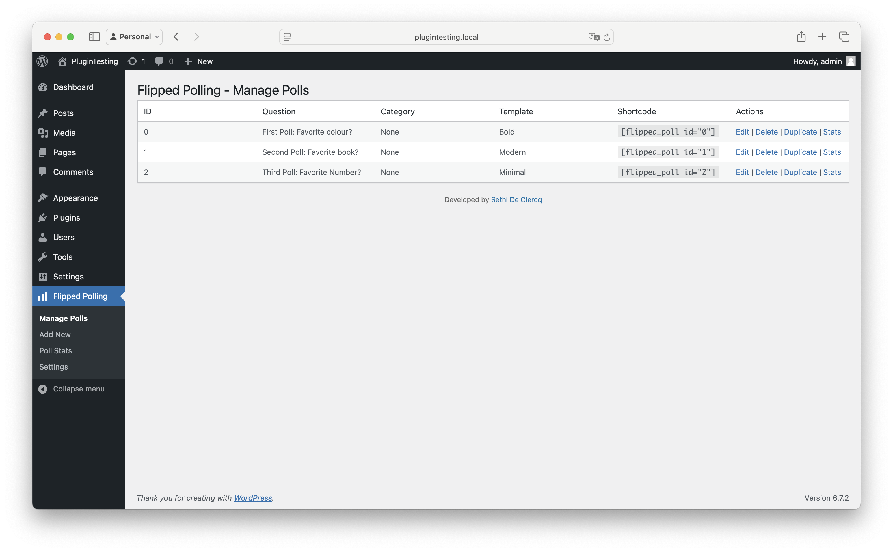
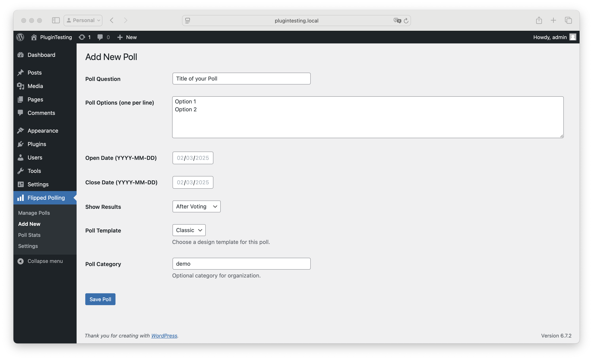
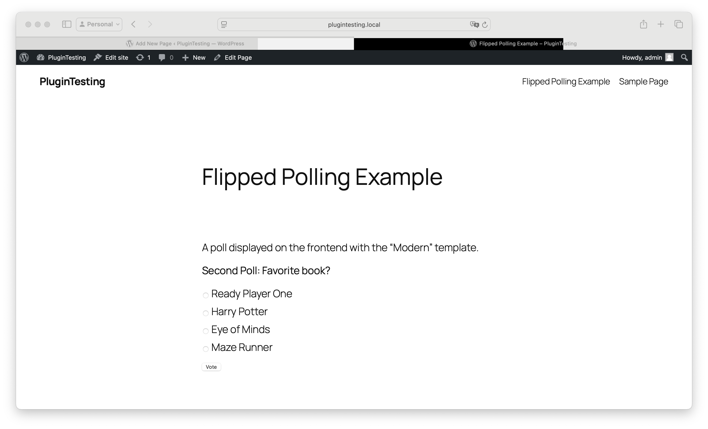
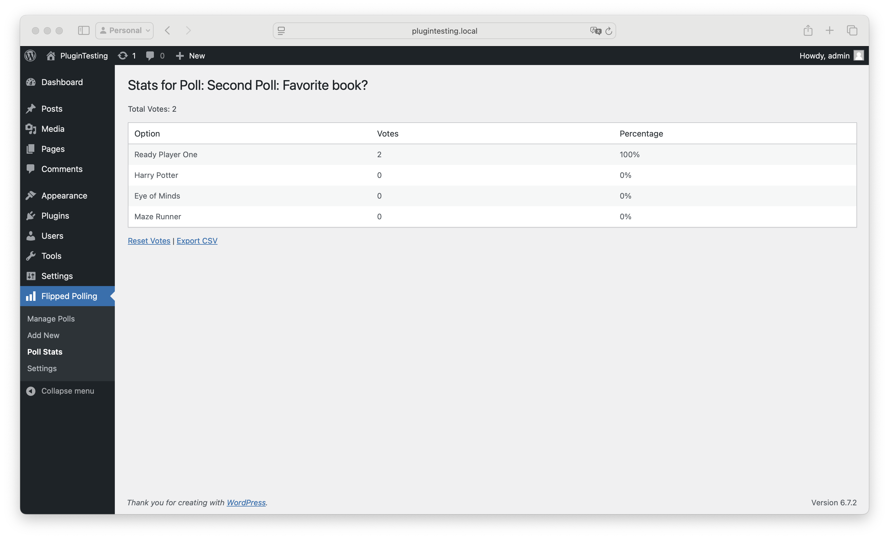

# Flipped Polling  

**Contributors:** sethidc  
**Donate link:** [https://wise.com/pay/me/sethid](https://wise.com/pay/me/sethid)  
**Tags:** polls, voting, survey, statistics  
**Requires at least:** 5.0  
**Tested up to:** 6.7.2  
**Stable tag:** 3.0  
**Requires PHP:** 7.0  
**License:** GPLv2 or later  
**License URI:** [http://www.gnu.org/licenses/gpl-2.0.html](http://www.gnu.org/licenses/gpl-2.0.html)  

A feature-rich polling plugin for WordPress with multiple polls, custom designs, stats, and more.

## Description

Flipped Polling allows you to create and manage polls with ease. Key features include:

* Multiple poll templates (Classic, Modern, Bold, Minimal, Dark)
* AJAX voting for seamless user experience
* Visual result bars
* CSV export for poll statistics
* Poll categories for organization
* Vote restriction options (Cookie, IP, User, None)
* Poll duplication
* Detailed stats dashboard

Use the shortcode `[flipped_poll id="0"]` to display a poll on any page or post.

## Installation

1.  Upload the `flipped-polling` folder to the `/wp-content/plugins/` directory.
    Or use the "Add New Plugin" option within WordPress and upload the zip file.
2.  Activate the plugin through the 'Plugins' menu in WordPress.
3.  Navigate to "Flipped Polling" in the admin menu to create and manage polls.
4.  Use the shortcode `[flipped_poll id="X"]` (replace X with the poll ID) to display polls.

## Screenshots

1.  The "Manage Polls" dashboard showing a list of created polls.

2.  The "Add New Poll" form with template and category options.

3.  A poll displayed on the frontend with the "Modern" template.
 
4.  Poll statistics page with export and reset options.
 

## Frequently Asked Questions

### How do I create a poll?

Go to "Flipped Polling" > "Add New" in the WordPress admin dashboard, fill out the form, and save.

### Can I show multiple polls on one page?

Yes, use multiple shortcodes like `[flipped_poll id="0"] [flipped_poll id="1"]`. Each poll operates independently and can have its own setting and look.

### How do I export poll stats?

Visit "Poll Stats," select a poll, and click "Export CSV."

## Changelog

### 3.0

* Initial public release with multi-file structure, AJAX voting, vote bars, CSV export, categories, and duplication features.

## Upgrade Notice

### 3.0

This is the first public version, packed with basic features to get started with robust polling functionality.
